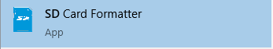
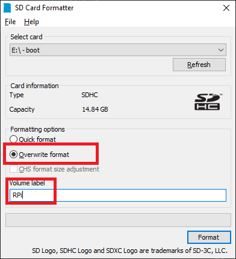
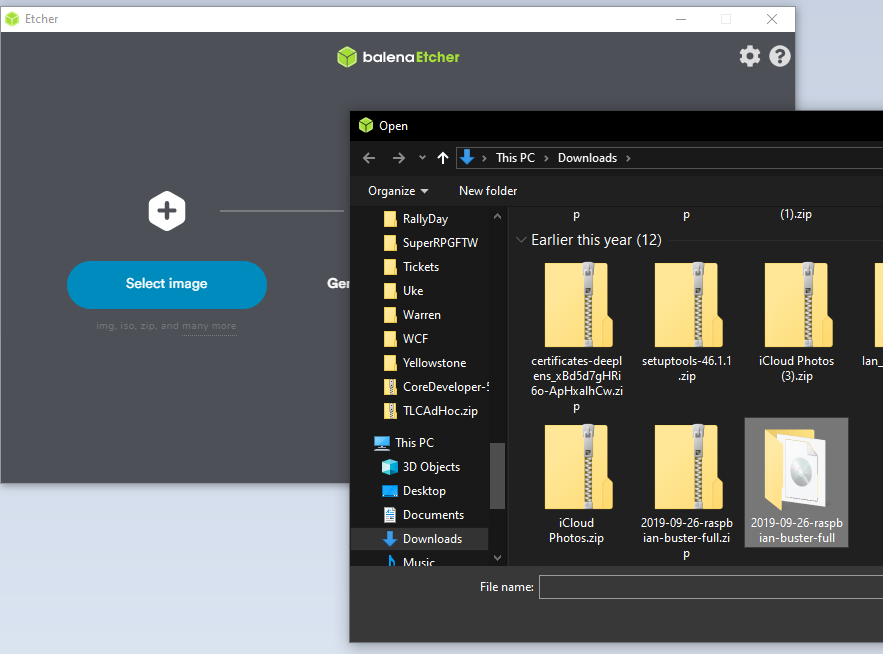
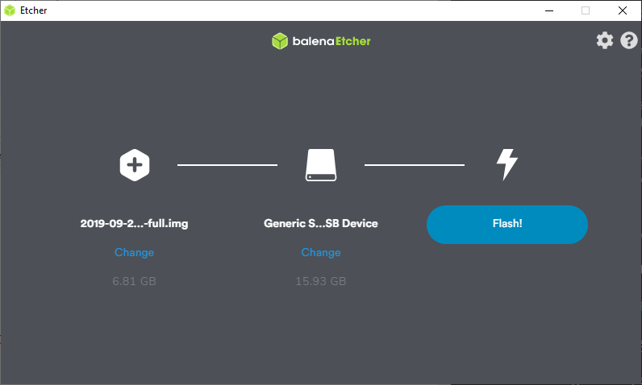

# IoT Central Device Training
## Module 01 - Setting up your Raspberry Pi

### Configuring the OS for the RPi (Raspbian)
Our first thing to set up is your Raspbian image on the SD card that you load will into the MicroSD cart slot on the Raspberry Pi.

#### Here are the tools you need to install...

* The official SD Card Formatter from the SD Association. Install for your OS. [LINK: SD Card Formatter](https://www.sdcard.org/downloads/formatter/)

* The tool called "balenaEtcher" which is used to copy your Raspbian image onto the formatted SD card. [LINK: balenaEtcher Download Page](https://www.balena.io/etcher/)

* The OS Image for the RPi. We will install the full package named "Raspbian Buster with desktop and recommended software" [LINK: Raspbian Buster Download Page](https://www.raspberrypi.org/downloads/raspbian/)

#### Now that you have all of that software installed, let's build our SD card for the RPi...

* Place your card into your SD slot on your computer and insure the system can see the card. DO NOT FORMAT IT if you are prompted by your Operating System, just dismiss the dialogs
* Start the SD Card Formatter software you downloaded. 



* The dialog will open, find your SD card (make sure the right drive is selected) and choose the option to "Overwrite format" and give your image a name 



Have a coffee, it will take a bit to do a 16gig card...

#### Next Let's Copy Buster to the SD Card...

* Close the SD Formatter Card application
* Open the balenaEtcher application...


* Click the "Select Image" button and select the zip file from the location where you saved it when you downloaded "Buster" from the Raspberry Pi download page
 
 

 * Select the "Flash!" button and sit back let the etcher copy the image and verify it



#### Enable ssh to allow remote login
For security reasons, ssh is no longer enabled by default. To enable it you need to place an empty file named ssh (no extension) in the root of the boot disk.

##### Mac instructions (enable ssh)
    Open up a terminal window and run this command:
    
    touch /Volumes/boot/ssh

##### Windows instructions (ssh)
    Run Notepad
    * In a new file put in one space and nothing more
    * Click File / Save As …
    * Be sure to set Save as type to All Files (so the file is NOT saved with a .txt extension)
    * Call the file ssh and save it
    * Close the file
    
    If you are comfortable with the Windows command line you could try this instead (untested!):
        * Open up a command line
        * Switch to the drive and root where boot is located:
        * Type: type NUL >> ssh
        * Verify that file ssh was created

#### Add your WiFi network info
Create a file in the root of boot called: wpa_supplicant.conf (instructions below). Then paste the following into it (adjusting for your ISO 3166 alpha-2 country code, network name and network password):

```
country=US
ctrl_interface=DIR=/var/run/wpa_supplicant GROUP=netdev
update_config=1

network={
    ssid="NETWORK-NAME"
    psk="NETWORK-PASSWORD"
}
```

##### Mac instructions (wifi settings)
Create a new empty file that will hold network info:

     touch /Volumes/boot/wpa_supplicant.conf

Edit the file that you just created and paste the text above into it (adjusting for the name of your country code, network name and network password):

##### Windows instructions (wifi settings)
* Run Notepad
* Paste in the contents above (adjusting for the name of your country code, network name and network password)
* Click File / Save As …
    Be sure to set Save as type to All Files (so the file is NOT saved with a .txt extension)
* Call the file wpa_supplicant.conf and save it
* Close the file
 
#### Eject the micro SD card
Right-click on boot (on your desktop or File Explorer) and select the Eject option
This is a “logical” eject - meaning it closes files and preps the SD card for removal - you still have to pull the card out yourself


#### Congratulations, you have prepared your OS for the Raspberry Pi

* Make sure your RPi is not plugged in
* Looking from the top of the RPi, install the SD card (the slot is on the bottom of the board) as shown in the picture below...

 

## [NEXT: Module 02 - Getting to Know the Raspberry Pi](../Module02/README.md)