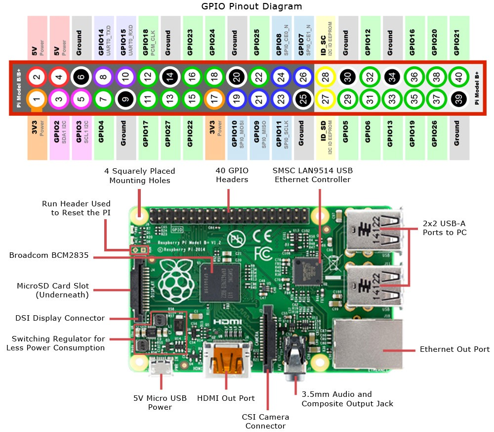
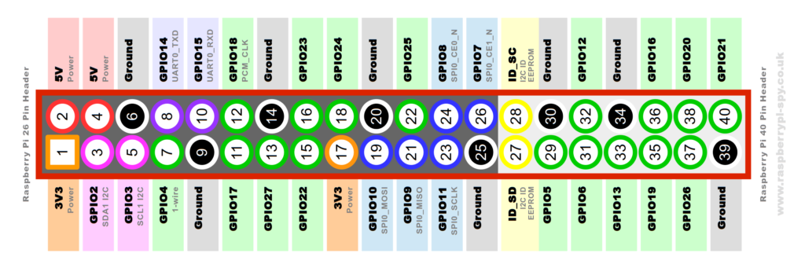

# IoT Central Device Training
## Module 02 - Getting to Know the Raspberry Pi

## A Tour of the Board



#### NOTE: The following is the text of the Raspberry Pi Org...

A powerful feature of the Raspberry Pi is the row of GPIO (general-purpose input/output) pins along the top edge of the board. A 40-pin GPIO header is found on all current Raspberry Pi boards (unpopulated on Pi Zero and Pi Zero W). Prior to the Pi 1 Model B+ (2014), boards comprised a shorter 26-pin header.

Any of the GPIO pins can be designated (in software) as an input or output pin and used for a wide range of purposes.

Note: the numbering of the GPIO pins is not in numerical order; GPIO pins 0 and 1 are present on the board (physical pins 27 and 28) but are reserved for advanced use (see below).

### Voltages
Two 5V pins and two 3V3 pins are present on the board, as well as a number of ground pins (0V), which are unconfigurable. The remaining pins are all general purpose 3V3 pins, meaning outputs are set to 3V3 and inputs are 3V3-tolerant.

### Outputs
A GPIO pin designated as an output pin can be set to high (3V3) or low (0V).

### Inputs
A GPIO pin designated as an input pin can be read as high (3V3) or low (0V). This is made easier with the use of internal pull-up or pull-down resistors. Pins GPIO2 and GPIO3 have fixed pull-up resistors, but for other pins this can be configured in software.

### More
As well as simple input and output devices, the GPIO pins can be used with a variety of alternative functions, some are available on all pins, others on specific pins.

#### PWM (pulse-width modulation)
Software PWM available on all pins
Hardware PWM available on GPIO12, GPIO13, GPIO18, GPIO19

#### SPI
SPI0: MOSI (GPIO10); MISO (GPIO9); SCLK (GPIO11); CE0 (GPIO8), CE1 (GPIO7)
SPI1: MOSI (GPIO20); MISO (GPIO19); SCLK (GPIO21); CE0 (GPIO18); CE1 (GPIO17); CE2 (GPIO16)

#### I2C
Data: (GPIO2); Clock (GPIO3)
EEPROM Data: (GPIO0); EEPROM Clock (GPIO1)

#### Serial
TX (GPIO14); RX (GPIO15)

## Raspberry Pi 40-pin GPIO Header

The Raspberry header is the key to its ability to interface with the real world. The Pi either uses a 40-pin or 26-pin depending on the model and it is important to understand how those pins are arranged and labelled.



If you are reading the Raspberry Pi copyright statement printed on the PCB then Pin 1 is in the bottom left and Pin 40 is in the top right.

The GPIO header provides the following power and interface options :

* 3.3V (on 2 pins)
* 5V (on 2 pins)
* Ground (on 8 pins)
* General purpose input and output
* PWM (pulse width modulation)
* I2C
* I2S
* SPI
* Serial

These allow a massive range of sensors, motors, LEDs and accessories to be connected to the Pi.

### Pin Labels – Clear as Mud
The labels above are the names of the pins on the Broadcom system chip to which the pin is physically connected. Much of the confusion around the GPIO is due to these labels, their relationship to the Broadcom labels and how they are referred to in your programs. To confuse things even more the GPIO pins are sometimes renamed with another set of numbers. In order to avoid damaging your Pi you need to be sure what pins you are connecting to other hardware and that your program is referring to the correct pins.

### GPIO Header Power Pins
The header provides 5V on Pin 2 and 3.3V on Pin 1. The 3.3V supply is limited to 50mA. The 5V supply draws current directly from your microUSB supply so can use whatever is left over after the board has taken its share. A 1A power supply could supply up to 300mA once the board has drawn 700mA. Power management has been improved with each iteration of hardware.

### Basic GPIO
The header provides 17 Pins that can be configured as inputs and outputs. By default they are all configured as inputs except GPIO 14 & 15.

In order to use these pins you must tell the system whether they are inputs or outputs. This can be achieved a number of ways and it depends on how you intend to control them.

### GPIO in Python
The easiest way to control the GPIO pins is using the RPi.GPIO Python library. Installing the library is easy if you follow my RPi.GPIO Installation Guide. Once installed using the pins is as easy as :

```python
import RPi.GPIO as GPIO
 
# Use GPIO numbers not pin numbers
GPIO.setmode(GPIO.BCM)
 
# set up the GPIO channels - one input and one output
GPIO.setup(7, GPIO.IN)
GPIO.setup(8, GPIO.OUT)
 
# input from GPIO7
input_value = GPIO.input(7)
 
# output to GPIO8
GPIO.output(8, True)
```

In this example we use GPIO7 (pin 26) and GPIO8 (pin 24).

### Pin Protection
Most of the pins in the header go directly to the Broadcom chip. It is important to carefully design the components you attach to them as there is a risk you will permanently damage your Pi. Short circuits and wiring mistakes could also ruin your day so double check everything. A multimeter is probably going to help a lot here as you can double check wiring before you connect to the Pi.

## [NEXT: Module 03 - Setting up your Development Toolchain](../Module03/README.md)