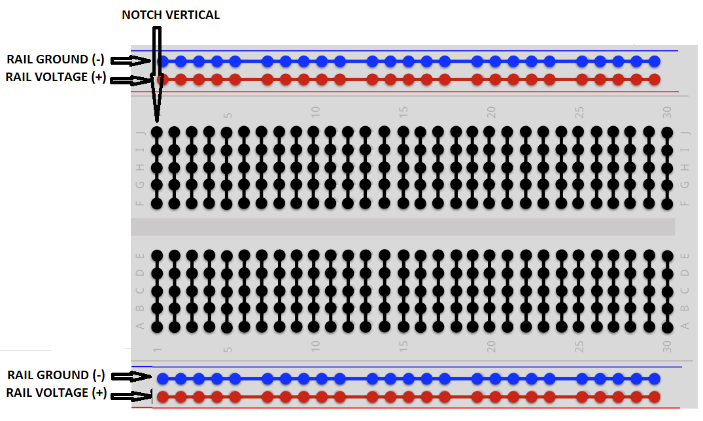
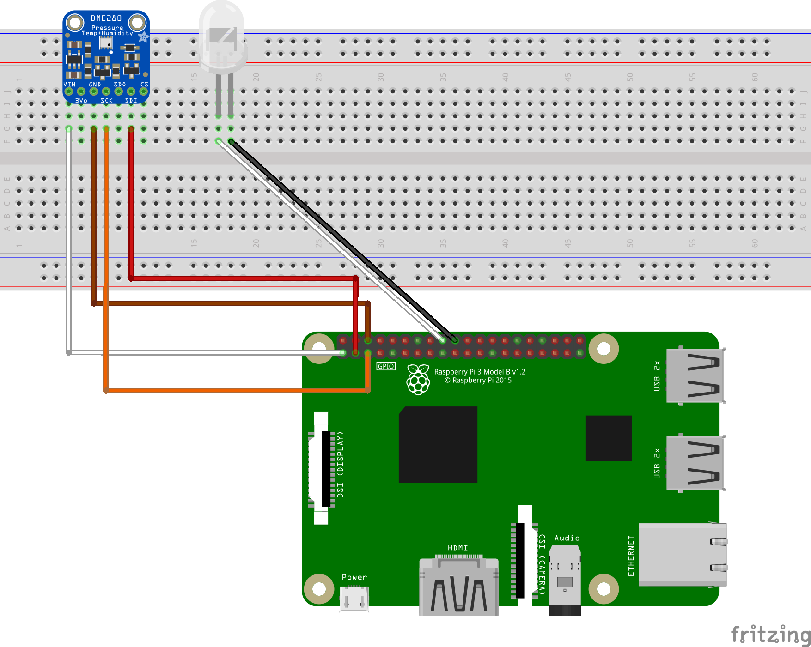
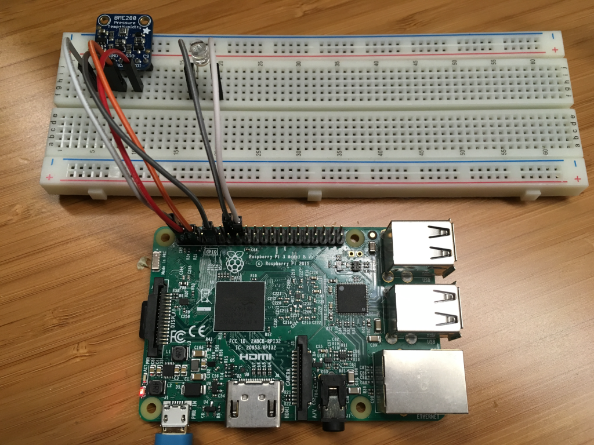

# IoT Central Device Training
## Module 06 - Introduction to Breadboarding

The breadboard is a handy layout that facilitiates prototyping with the Raspberry Pi...



In the above example, you would set one voltage rail for 5V and the other for 3.3V and this would let you try out all the sensors.





The BME280 sensor can collect temperature and humidity data. The LED blinks when the device sends a message to the cloud.
For sensor pins, use the following wiring:
```
Start (Sensor & LED)        End (Board)         Cable Color
-----------------------------------------------------------
VDD (Pin 5G)                3.3V PWR (Pin 1)    White cable
GND (Pin 7G)                GND (Pin 6)         Brown cable
SDI (Pin 10G)               I2C1 SDA (Pin 3)    Red cable
SCK (Pin 8G)                I2C1 SCL (Pin 5)    Orange cable
LED VDD (Pin 18F)           GPIO 24 (Pin 18)    White cable
LED GND (Pin 17F)           GND (Pin 20)        Black cable
```

## [Module 07 - Setting up the Raspberry Pi for Running Python Applications](../Module07/README.md)