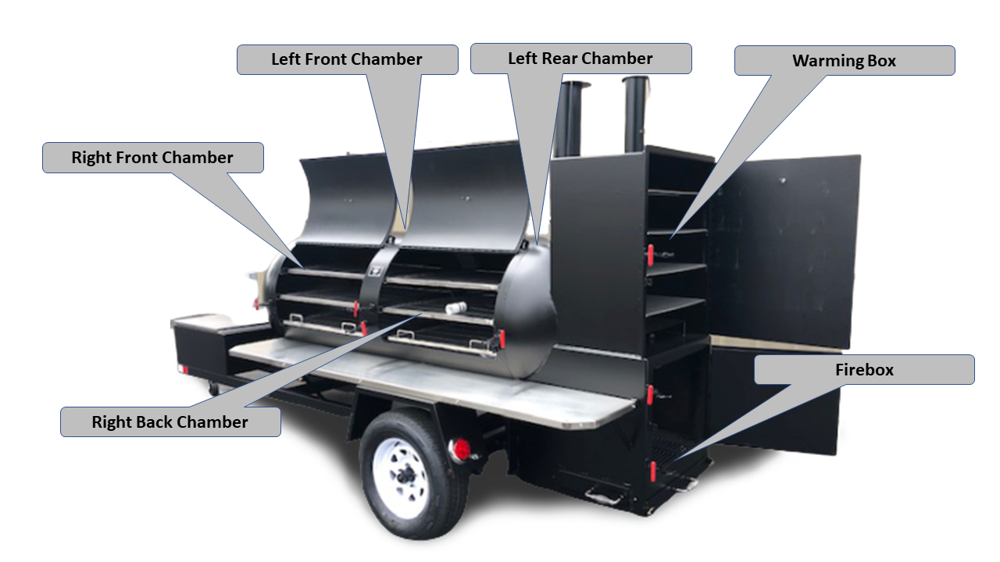
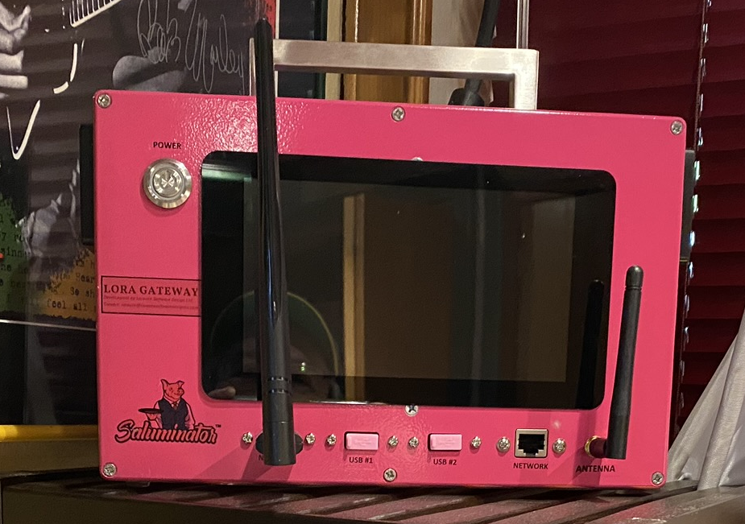
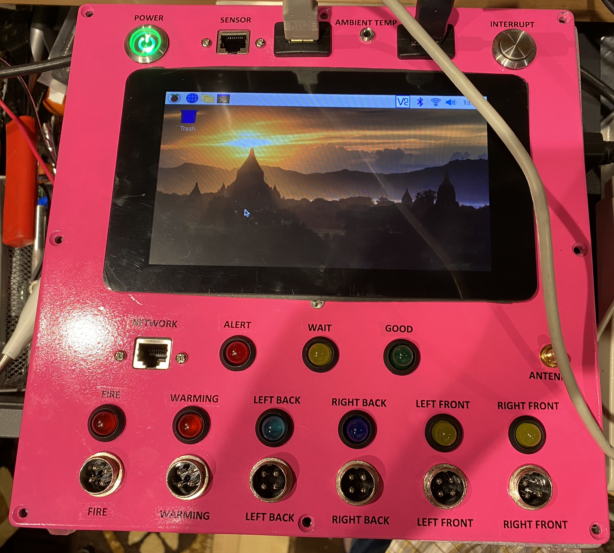

# IoT Central Device Training
## Module 15 - Working with other Cloud Systems (Things Network)

LoRaWan (Low-Ra) and the Things Network are a popular means of connectivity and platform support in scenarios like Smart Cities and other scenarios where the configuration of Wifi and moew complex networking protocols maybe a challenge.

I have built a BBQ Monitoring System that uses LoRa and the Things Network to cpature temperature data. That data is then sent back to IoT Central for dashboards, etc.

## This is Yoder and the Areas we Monitor in a Cook
 

## This the Saluminator LoRa Gateway Device
 

## This the Yoder Monitor Device
 

## Let's dig into the tech stack!
* [LINK: IoT Lora Gateway Hat for Raspberry Pi](https://uk.pi-supply.com/products/iot-lora-gateway-hat-for-raspberry-pi)
* [LINK: Meadow Creek TS-500 BBQ](https://www.meadowcreekbbq.com/catalog/barbecue-smokers/ts500-reverse-flow-smoker-trailer/)
* [LINK: LoraWan](https://lora-alliance.org/)
* [LINK: The Things Network](https://www.thethingsnetwork.org/)
* [LINK: Yoder at Azure IoT Central](https://yoder-observer.azureiotcentral.com/)
* [LINK: Eastwood Powder Coating Equipment](https://www.eastwood.com/hotcoat-powder-coating.html)
* [LINK: X-Carve CnC Machines](https://www.inventables.com/technologies/x-carve)

## What Yoder Sends to the Things Network (Much More Compact than our Json Payloads)

### Python Snippet (Variables)...
``` Python
    Name_Temperature_Ambient = "Ambient"
    Name_Temperature_FireBox = "Fire Box"
    Name_Temperature_WarmingBox = "Warming Box"
    Name_Temperature_LeftBack = "Left Back Chamber"
    Name_Temperature_RightBack = "Right Back Chamber"
    Name_Temperature_LeftFront = "Left Front Chamber"
    Name_Temperature_RightFront = "Right Front Chamber"

    Temperature_Ambient = 0.0
    Temperature_FireBox = 0.0
    Temperature_WarmingBox = 0.0
    Temperature_LeftBack = 0.0
    Temperature_RightBack = 0.0
    Temperature_LeftFront = 0.0
    Temperature_RightFront = 0.0
```

### Python Snippet (Read Thermocouplers)...
``` Python

        # READ FIREBOX
        print ("Reading the FIRE BOX TEMPERATURE...")
        DAQC.setDOUTbit(PiPlate_DACQ, PiPlate_THERMO_STATUS_FireBox)
        Temperature_FireBox = THERMO.getTEMP(PiPlate_THERMO, PiPlate_THERMO_FireBox)
        time.sleep(3) 
        DAQC.clrDOUTbit(PiPlate_DACQ, PiPlate_THERMO_STATUS_FireBox)

        # READ WARMING BOX
        print ("Reading the WARMING BOX TEMPERATURE...")
        DAQC.setDOUTbit(PiPlate_DACQ, PiPlate_THERMO_STATUS_WarmingBox)
        Temperature_WarmingBox = THERMO.getTEMP(PiPlate_THERMO, PiPlate_THERMO_WarmingBox)
        time.sleep(3) 
        DAQC.clrDOUTbit(PiPlate_DACQ, PiPlate_THERMO_STATUS_WarmingBox)
```

### Python Snippet (Send Payload to the Things Network)...
``` Python

        msg = ("%s:%d %s:%d %s %d %s %d %s %d %s %d %s %d" % (
            Name_Temperature_Ambient, Temperature_Ambient,
            Name_Temperature_FireBox, Temperature_FireBox,
            Name_Temperature_WarmingBox, Temperature_WarmingBox,
            Name_Temperature_LeftBack, Temperature_LeftBack,
            Name_Temperature_RightBack, Temperature_RightBack,
            Name_Temperature_LeftFront, Temperature_LeftFront,
            Name_Temperature_RightFront, Temperature_RightFront))

        print ("Sending: %s" % msg)

        msg = struct.pack('fffffff', Temperature_Ambient, Temperature_FireBox, Temperature_WarmingBox, Temperature_LeftBack, Temperature_RightBack, Temperature_LeftFront, Temperature_RightFront)

        lora.send(msg)
```

## [NEXT: Module 16 - Connecting the Things Network to Azure IoT Central Via Device Bridge](../Module16/README.md)