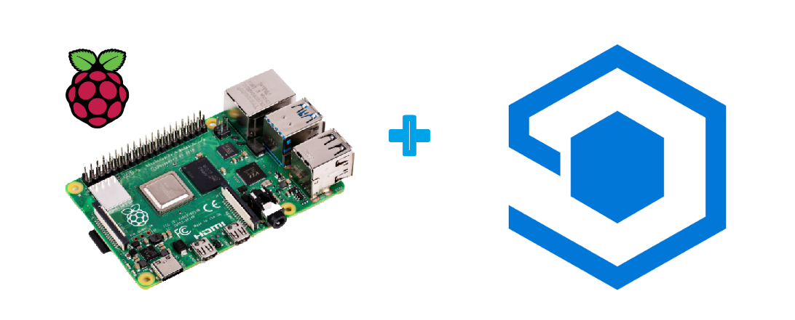

#  IoT Central Device Training

## Module 01 - Setting up your Raspberry Pi
[LINK: Module 01 - Setting up your Raspberry Pi](./Module01/README.md)

## Module 02 - Getting to Know the Raspberry Pi
[LINK: Module 02 - Getting to Know the Raspberry Pi](./Module02/README.md)

## Module 03 - Setting up your Development Toolchain
[LINK: Module 03 - Setting up your Development Toolchain](./Module03/README.md)

## Module 04 - Enabling Capabilities on the Raspberry Pi
[LINK: Module 04 - Enabling Capabilities on the RPi](./Module04/README.md)

## Module 05 - Connecting using SSH to your Raspberry Pi
[LINK: Module 05 - Connecting using SSH to your Raspberry Pi](./Module05/README.md)

## Module 06 - Introduction to Breadboarding
[LINK: Module 06 - Introduction to Breadboarding](./Module06/README.md)

## Module 07 - Setting up the Raspberry Pi for Running Python Applications
[LINK: Module 07 - Setting up the Raspberry Pi for Running Python Applications](./Module07/README.md)

## Module 08 - Communicating with Sensors, LED, etc
[LINK: Module 08 - Communicating with Sensors, LED, etc](./Module08/README.md)

## Module 09 - Create your Azure IoT Central Application
[LINK: Module 09 - Create your Azure IoT Central Application](./Module09/README.md)

## Module 10 - Connecting to Azure IoT Central (Python SDK)
[LINK: Module 10 - Connecting to Azure IoT Central (Python SDK)](./Module10/README.md)

## Module 11 - Device Authentication Types (SaS, Certs, TPM and IR Certs)
[LINK: Module 11 -  Device Authentication Types (SaS, Certs, TPM and IR Certs)](./Module11/README.md)

## Module 12 - Sending Telemetry from your Raspberry Pi to IoT Central
[LINK: Module 12 - Sending Telemetry from your Raspberry Pi to IoT Central](./Module12/README.md)

## Module 13 - Writing Device Commands and Executing on your Raspberry Pi to/from IoT Central
[LINK: Module 13 - Writing Device Commands and Executing on your Raspberry Pi to/from IoT Central](./Module13/README.md)

## Module 14 - Twin Updates and Notifications of Cloud Desired Properties
[LINK: Module 14 - Twin Updates and Notifications of Cloud Desired Properties](./Module14/README.md)

## Module 15 - Working with other Cloud Systems (Things Network)
[LINK: Module 15 - Working with other Cloud Systems (Things Network)](./Module15/README.md)

## Module 16 - Connecting the Things Network to Azure IoT Central Via Device Bridge
[LINK: Module 16 - Connecting the Things Network to Azure IoT Central Via Device Bridge](./Module16/README.md)

## Module 17 - Azure IoT Central Continuous Data Export Scenarios
[LINK: Module 17 - Azure IoT Central Continuous Data Export Scenarios](./Module17/README.md)
