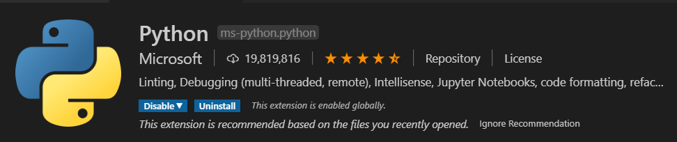

# Raspberry Pi Gateway and Arduino Nano BLE Devices for Azure Iot Central
## Module 03 - Setting up your Development Toolchain (Local Machine)

# Your Local Machine
The development "toolchain" refers to all of the various tools, SDK's and bits we need to install on your machine to facilitate a smooth experience developing our BLE devices and the Raspberry Pi Gateway device. Our main development tool will be Visual Studio code. It has dependancies on tools from Arduino and other open source projects, but it will be the central place where all our development will occur making it easy to follow along regardless of which operating system you are working on.

### Install Git
Git is the tool we use for version control and management of software assets. Our workshop will use it to clone the modules and also to publish anything you may want to share with others. Git is usually installed already and you can check if you have the latest by opening a terminal or command window and typing...

```
git --version
```

[LINK: Git Installation Page](https://git-scm.com/book/en/v2/Getting-Started-Installing-Git)

### Install Visual Studio Code
Visual Studio Code is a lightweight but powerful source code editor which runs on your desktop and is available for Windows, macOS and Linux. This is the IDE we will use to write code and deploy to the our BLE Devices and the Raspberry Pi Gateway. 

[LINK: Visual Studio Code Installation Page](https://code.visualstudio.com/download)

### Install PlatformIO
PlatformIO is a cross-platform, cross-architecture, multiple framework, professional tool for embedded systems engineers and for software developers who write applications for embedded products. It works seamlessly with Visual Studio Code poroviding...

* PlatformIO IDE - A new generation toolset for embedded C/C++ development. Intelligent code completion and Smart code linter with Built-in Terminal and Serial Port Monitor. 
* Development - Rapid Embedded Development with multi-platform build system. Continuous and IDE integration with the most popular Desktop and Cloud IDEs thanks to built-in project generator. 
* Library Registry - Thousands of Popular Libraries are organized into single platform with advanced search by keywords, missed or known headers, etc. Project Dependency Manager with Semantic Versioning requireme

[LINK: PlatformIO Homepage](https://platformio.org/)

### Install Python
Pyhon is the language we will use to build applications for the Raspberry Pi.

From the Python Org: 
* Python is powerful... and fast;
* plays well with others; 
* runs everywhere; 
* is friendly & easy to learn; 
* is Open.

[LINK: Python 3 Installation Page](https://www.python.org/downloads/)

### Upgrading pip
Pip is the package manager we will use to download packages

On Linux or macOS (Open Terminal):
```
    pip install -U pip
```
On Windows (from a CMD window or Powershell):
```
    python -m pip install -U pip
```

### Install all the Tools for Visual Studio Code
These are a set of tools we will use to develop our apps on the Raspberry Pi. You can open the Extensions sidebar with "Shift+Ctrl+X) or click the icon in the side navigator bar.




## [NEXT: Module 04 - Nano BLE Device Overview, Setup and Connecting](../Module04/README.md)