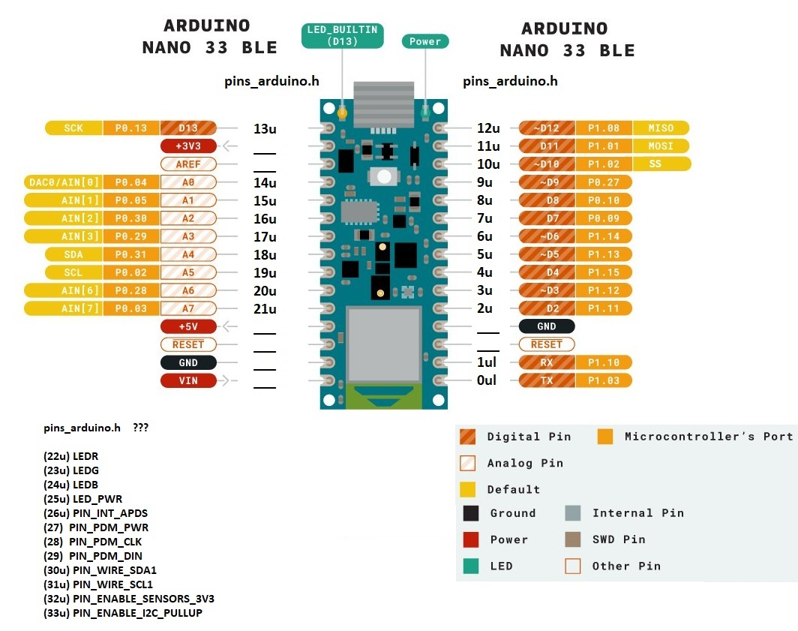

# Raspberry Pi Gateway and Arduino Nano BLE Devices for Azure Iot Central
## Nano BLE Device Overview, Setup and Connecting

Overview of the Arduino Nano BLE Device for our Gateway.

BLE DEVICE BOM
-----------------------------------
* Arduino Nano 33 BLE
* Makefun Nano Adaptor
* MakerFocus 1000 mAh Battery and Battery Charging Module
* DHT11 Temperature and Humidy Sensor
* Aluminum Project Case (CNC'd & Powdercoated)

FEATURES
-----------------------------------
* Temperature
* Humidity
* Re-Chargeable
* Portable

")

## Arduino Nano BLE Pinout and Carrier Board

Below is the Pinout of the Arduino Nana BLE 33

Below an overview of the Makefun Carrier Board

Makefun Carrier Board Schematic

## [Module 05 - Connecting using SSH to your Raspberry Pi](../Module05/README.md)