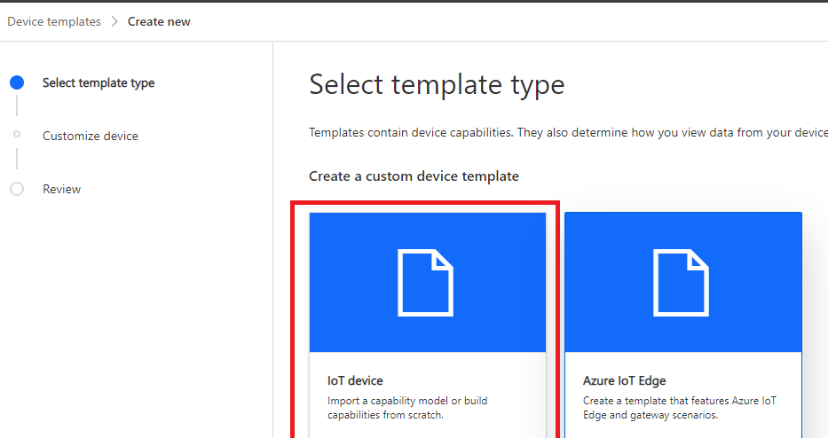
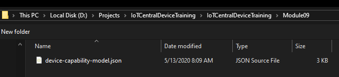

# IoT Central Device Training
## Module 09 - Create your Azure IoT Central Application

Let's create an application in IoT Central that we will use for connecting and testing our device based on a sample Device Capability Model specific for this workshop (thanks Ian!).

## Create your App
* [LINK: Start at IoT Central](https://apps.azureiotcentral.com)
* Goto "My Apps" and click the "+ New Application" button
* Choose "Custom Apps" Icon Button
* Name your application, make it a paid app
* Insure that the "Billing Information" section is in your subscription that you have access, etc.

## Create your DCM
* Goto "Device Templates" and click the "+ New" button
* Click the "IoT Device" image button



* Click the "Next: Customize" button at the bottom of the screen
* Click the "Next: Review" button at the bottom of the screen
* Click the "Create" button at the bottom of the screen
* Give your Device Template a name and press enter
* Click the "Import capability model" image button


Select the json file named "device-capability-model.json" located in Module09 folder from the git clone we did at the start of the workshop



# STOP - Instruction Time
## We will walk through creating some simple visualizations and publish.

We will be basing our DCM in the Sample App on the Json  below...
``` Json
{
  "@id": "urn:sample:python:1",
  "@type": "CapabilityModel",
  "displayName": "Python sample model",
  "description": "Created for use with the python sample code for IoT Central - Feb 2020",
  "@context": [
      "http://azureiot.com/v1/contexts/IoTModel.json"
  ],
  "implements": [ 
    {
      "@type": "InterfaceInstance",
      "name": "pythonsample",
      "schema": {
        "@id": "urn:sample:python:iotcentral:1",
        "@type": "Interface",
        "displayName": {
          "en": "Interface"
        },
        "contents": [
          {
            "@type": "Telemetry",
            "displayName": {
              "en": "temp"
            },
            "name": "temp",
            "schema": "double"
          },
          {
            "@type": "Telemetry",
            "displayName": {
              "en": "humidity"
            },
            "name": "humidity",
            "schema": "double"
          },
          {
            "@type": "Property",
            "displayName": {
              "en": "fan"
            },
            "name": "fan",
            "writable": true,
            "schema": "boolean"
          },
          {
            "@type": "Property",
            "displayName": {
              "en": "text"
            },
            "name": "text",
            "schema": "string"
          },
          {
            "@type": "Property",
            "displayName": {
              "en": "number"
            },
            "name": "number",
            "schema": "double"
          },
          {
            "@type": "Property",
            "displayName": {
              "en": "boolean"
            },
            "name": "boolean",
            "schema": "boolean"
          },
          {
            "@type": "Command",
            "commandType": "synchronous",
            "request": {
              "@type": "SchemaField",
              "displayName": {
                "en": "text"
              },
              "name": "text",
              "schema": "string"
            },
            "response": {
              "@type": "SchemaField",
              "displayName": {
                "en": "echotext"
              },
              "name": "echotext",
              "schema": "string"
            },
            "displayName": {
              "en": "echo"
            },
            "name": "echo"
          }
        ],
        "@context": [
          "http://azureiot.com/v1/contexts/IoTModel.json"
        ]
      }
    }
  ]
}
```

## [Module 10 - Connecting to Azure IoT Central (Python SDK)](../Module10/README.md)